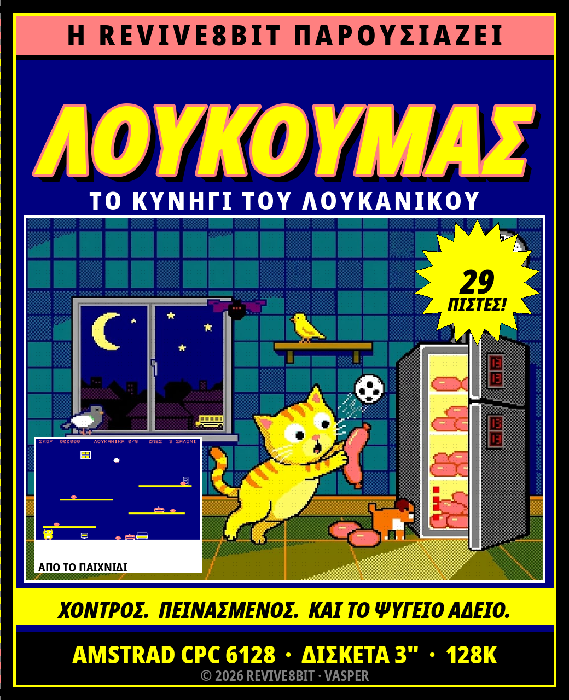
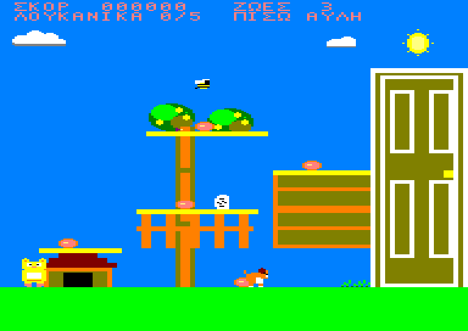
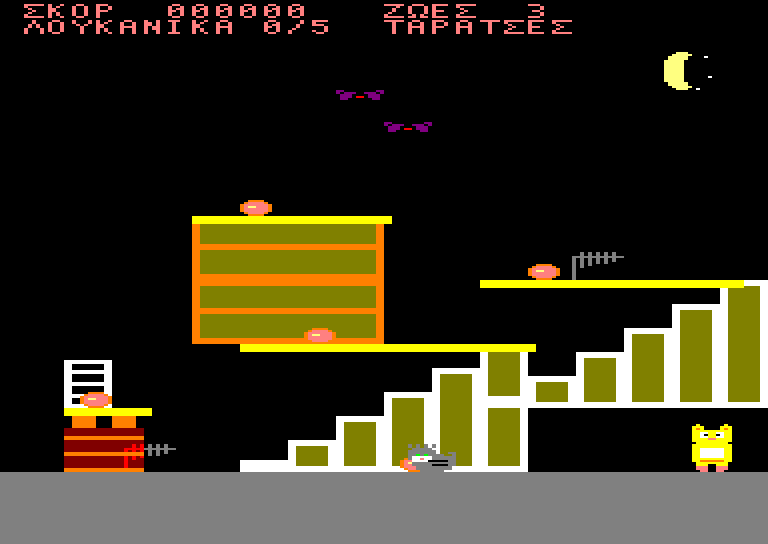
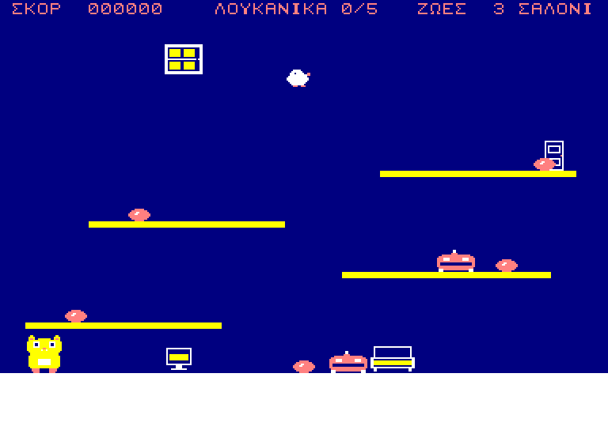
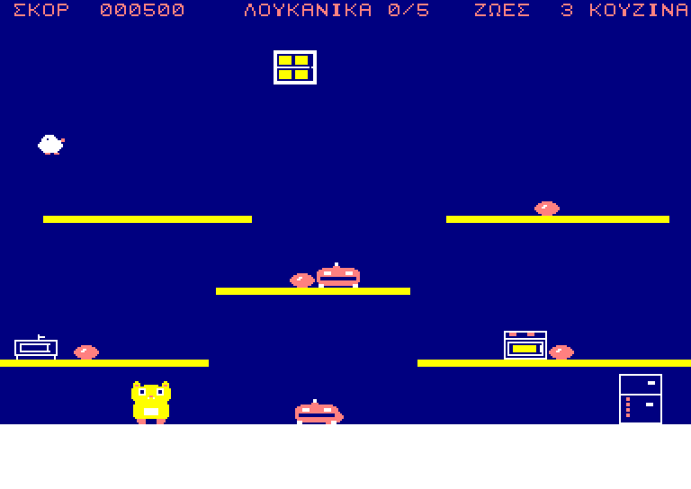
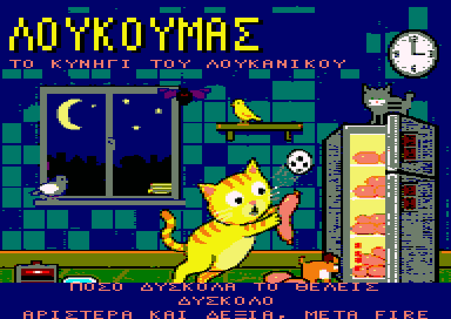

# ΛΟΥΚΟΥΜΑΣ
## ΤΟ ΚΥΝΗΓΙ ΤΟΥ ΛΟΥΚΑΝΙΚΟΥ

**AMSTRAD CPC 6128 · ΔΙΣΚΕΤΑ 3" · 128K**

*Μια παραγωγή REVIVE8BIT · © 2026*



> In English: [MANUAL.en.md](MANUAL.en.md) · Βιβλιαράκι:
> [PDF στα ελληνικά](docs/manual-el.pdf), [PDF in English](docs/manual-en.pdf)

---

## ΦΟΡΤΩΣΗ

1. Ανάψτε τον CPC 6128 και περιμένετε το `Ready`.
2. Βάλτε τη δισκέτα στον οδηγό A, με την ετικέτα προς τα πάνω.
3. Γράψτε

   ```
   RUN"LOUK
   ```

   και πατήστε `ENTER`.
4. Θα εμφανιστεί η οθόνη της REVIVE8BIT όσο φορτώνει το παιχνίδι. Πατήστε
   `SPACE` όταν είστε έτοιμοι, ή απλώς περιμένετε δέκα δευτερόλεπτα και ξεκινάει
   μόνο του.
5. Μετά από ενάμισι δευτερόλεπτο ησυχίας, η αρχική οθόνη ζωγραφίζεται σε
   ολόκληρο το overscan και αρχίζει η μουσική.

**Μην** πατήσετε `ESC` και μην κάνετε reset όσο ανάβει το λαμπάκι του οδηγού.

*Σε 464 ή 664 δεν φορτώνει. Το παιχνίδι θέλει 128K: χρησιμοποιεί ολόκληρο το
μισό της μηχανής για οθόνη.*


---

## Η ΙΣΤΟΡΙΑ ΜΕΧΡΙ ΕΔΩ

Είναι τρεις και τέταρτο τα ξημερώματα, στο διαμέρισμα της κυρα-Ευδοκίας στην
Κυψέλη. Όλοι κοιμούνται. Όλοι εκτός από έναν.

Ο **Λουκουμάς** — αφράτος, υπέρβαρος γάτος ράτσας European Shorthair, με κοντά
ποδαράκια, τεράστια μάτια και ακόρεστη αγάπη για τα αλλαντικά — ξύπνησε από το
ίδιο του το στομάχι. Η κυρα-Ευδοκία όμως τον έβαλε σε δίαιτα, και το σπίτι δεν
είναι πια δικό του: μια σκούπα-ρομπότ κάνει περιπολίες στο πάτωμα όλη νύχτα,
και το καναρίνι της, ο **Τουίτι-Μπόξερ**, πετάει ελεύθερο από δωμάτιο σε
δωμάτιο.

Ο Λουκουμάς ξεκινάει από το υπόγειο με έναν σκοπό: να ανέβει ως την κουζίνα και
να ανοίξει το μεγάλο δίπορτο Pitsos.

**Και το βρίσκει άδειο.**

Το τελευταίο, το μεγάλο, πήγε σχολείο στο ταπεράκι της **Μυρτώς**, της εγγονής
της κυρα-Ευδοκίας. Απ' έξω ακούγεται το σχολικό να παίρνει μπρος.

Από εκεί και πέρα δεν είναι επιδρομή· είναι κυνήγι, και κρατάει άλλες δεκαεννιά
πίστες: έξω από την πίσω αυλή, μέσα από τη γειτονιά, μέσα από όλο το σχολείο,
ως το κτηνιατρείο — και πίσω σπίτι από τις ταράτσες, κάτω από την καμινάδα, στο
δικό του τζάκι, όπου η Μυρτώ του έχει αφήσει ένα μπολ με γάλα.





**Είκοσι εννιά πίστες. Εννιά ζωές — ή τρεις, αν τις ζητήσετε. Ένα λουκάνικο.**

---

## ΧΕΙΡΙΣΜΟΣ

Πληκτρολόγιο ή joystick — όποιο θέλετε, όποτε θέλετε.

| Πληκτρολόγιο | Joystick | Τι κάνει |
|---|---|---|
| `←` `→` | αριστερά / δεξιά | Βάδισμα |
| `↑` ή `SPACE` | πάνω ή fire | Άλμα |
| `↓` | κάτω | **Roll** — μαζεύεται σε μπάλα |
| `↓` + `SPACE` στον αέρα | κάτω + fire | **BELLY-FLOP** |
| `L` (μόνο στην αρχική) | — | Ελληνικά / Αγγλικά |
| `SPACE` (αρχική οθόνη) | fire | Εκκίνηση |
| `ESC` | — | Εγκατάλειψη, πίσω στην αρχική οθόνη |

Το **roll** είναι και πιο γρήγορο από το βάδισμα και **πιο κοντό** από το
όρθιο. Υπάρχουν περάσματα σε αυτό το παιχνίδι όπου ο όρθιος Λουκουμάς δεν
χωράει. Αξιοπρέπεια δεν υπάρχει. Ούτως ή άλλως δεν υπήρχε από την αρχή.

### ★ ΤΟ BELLY-FLOP ★

Πηδήξτε, και ενώ είστε στον αέρα κρατήστε `↓` και πατήστε `SPACE`. Ο Λουκουμάς
μαζεύεται, πέφτει σαν σακί με αλεύρι και προσγειώνεται με την κοιλιά.
**Τραντάζεται όλο το δωμάτιο** — και ό,τι βρίσκεται περίπου στο ύψος που
προσγειώθηκε ζαλίζεται επιτόπου, όσο μακριά κι αν είναι πάνω στο ράφι.

Δεν είναι φιγούρα. Είναι η απάντηση σε ένα ρομπότ που περιπολεί ολόκληρο ράφι
και δεν σας αφήνει να πλησιάσετε το λουκάνικο στην άκρη του. Κάντε flop, και
περάστε από πάνω του όσο βλέπει αστεράκια.

*Ένας ζαλισμένος εχθρός είναι ακίνδυνο σκηνικό — μέχρι να σηκωθεί.*

---

## Η ΟΘΟΝΗ ΣΑΣ

Δύο σειρές στην κορυφή, και είναι το μόνο κομμάτι της οθόνης που δεν είναι το
παιχνίδι:

```
ΣΚΟΡ       001700          ΖΩΕΣ   9
ΛΟΥΚΑΝΙΚΑ  3/5             ΚΟΥΖΙΝΑ
```

| | |
|---|---|
| **ΣΚΟΡ** | Έξι ψηφία. Δεν μηδενίζει από πίστα σε πίστα |
| **ΖΩΕΣ** | Εννιά, έξι ή τρεις, ανάλογα με τη δυσκολία που διαλέξατε. Τόσες είναι και το πολύ |
| **ΛΟΥΚΑΝΙΚΑ** | Πόσα από τα πέντε της πίστας έχετε βρει |
| **Όνομα πίστας** | Πού βρίσκεστε. Και οι είκοσι εννιά έχουν όνομα |



Όταν συμβεί κάτι καλό, **αναβοσβήνει το περιθώριο της οθόνης**. Είναι το μόνο
πράγμα σε μια τόσο μεγάλη εικόνα που δεν μπορεί να σας ξεφύγει την ώρα που σας
κυνηγάνε.

---

## ΤΙ ΨΑΧΝΕΤΕ

**ΛΟΥΚΑΝΙΚΑ — πέντε σε κάθε πίστα, 100 πόντοι το ένα.**
Μαζέψτε και τα πέντε και η έξοδος της πίστας — πόρτα, εξαερισμός, ψυγείο,
καμινάδα — **αλλάζει** και γίνεται πέρασμα. Μέχρι τότε είναι έπιπλο. Δεν
χρειάζεται καμία σειρά, και τίποτα δεν ξαναγυρίζει όταν χάνετε ζωή: μια πίστα
μόνο πιο εύκολη γίνεται.

**ΤΟ ΜΠΟΛ ΜΕ ΤΟ ΓΑΛΑ — σε κάθε τρίτη πίστα.**
Οι πίστες 3, 6, 9, 12, 15, 18, 21, 24 και 27 έχουν ένα, και είναι **μία ζωή
πίσω** - ποτέ όμως πάνω από όσες ξεκινήσατε. Αν δεν έχετε χάσει καμία, αξίζει
500 πόντους, οπότε δεν πάει ποτέ χαμένο· αξίζει πολύ περισσότερα από τη στιγμή
που θα αρχίσετε να τις χάνετε, και στο δύσκολο — όπου είχατε μόνο τρεις
εξαρχής — ακόμα περισσότερα.



Είναι πάντα στο πιο άβολο ράφι της πίστας, και συνήθως σε αυτό που περιπολεί
κάποιος. Η έξοδος δεν το περιμένει: μπορείτε να τελειώσετε την πίστα και να το
αφήσετε. Αν αξίζει, είναι θέμα ανάμεσα σε εσάς και τις ζωές που σας έμειναν.

---

## ΤΙ ΨΑΧΝΕΙ ΕΣΑΣ

Τρεις σε κάθε πίστα. Η επαφή με οποιονδήποτε κοστίζει μία ζωή και σας βάζει
πίσω στην αρχή της πίστας με **δύο δευτερόλεπτα ασυλίας** για να φύγετε από τη
μέση.

Στο παιχνίδι υπάρχουν μόνο δύο συμπεριφορές — κάτι που περπατάει σε ράφι και
κάτι που πετάει σε τόξο. Μάθετε τις δύο και τα ξέρετε και τα δώδεκα:

| | Περπατάει | Πετάει | Πού |
|---|:---:|:---:|---|
| Σκούπα-ρομπότ | ● | | το σπίτι |
| Το καναρίνι | | ● | το σπίτι |
| Ο σκύλος του διπλανού | ● | | αυλή, πεζοδρόμιο, κτηνιατρείο |
| Περιστέρι | | ● | πάρκο, δρόμος, ταράτσες |
| Σφήκα | | ● | όπου υπάρχουν λουλούδια |
| Μπάλα | ● | | παιδική χαρά, γυμναστήριο, γήπεδο |
| Χάρτινο αεροπλανάκι | | ● | το σχολείο |
| Ο κουβάς του επιστάτη | ● | | το σχολείο |
| Κάτι πράσινο | ● | | το χημείο |
| Σύριγγα | | ● | το κτηνιατρείο |
| Νυχτερίδα | | ● | ταράτσες, καμινάδα |
| Ο αδέσποτος γάτος | ● | | ταράτσες, πάρκινγκ |

Κανείς δεν σας πυροβολεί. Κανείς δεν σας ακολουθεί. Δεν χρειάζεται — οι πίστες
είναι μικρές και εσείς δεν είστε γρήγορος.

---

## ΠΟΣΟ ΔΥΣΚΟΛΑ ΤΟ ΘΕΛΕΤΕ

Μετά την αρχική οθόνη, και πριν από την πρώτη πίστα, το παιχνίδι ρωτάει.
Αλλάξτε με `←` και `→`, δεχτείτε με `SPACE`.



| | Ζωές | Οι εχθροί | Η ζάλη από το belly-flop |
|---|:---:|---|---|
| **ΕΥΚΟΛΟ** | 9 | στη μισή ταχύτητα | τέσσερα δευτερόλεπτα |
| **ΜΕΣΑΙΟ** | 6 | στα δύο τρίτα | τρία δευτερόλεπτα |
| **ΔΥΣΚΟΛΟ** | 3 | κανονικά | δύο δευτερόλεπτα |

**Το ΔΥΣΚΟΛΟ είναι το παιχνίδι όπως σχεδιάστηκε** — τρεις ζωές, και όλα να
κινούνται με την ταχύτητα που σχεδιάστηκαν. Το εύκολο και το μεσαίο δεν κάνουν
τον Λουκουμά γρηγορότερο ούτε τις πίστες πιο βολικές: σας δίνουν περισσότερες
ζωές και περισσότερο χρόνο να σκεφτείτε. Το άλμα είναι το ίδιο άλμα, τα ράφια στην ίδια
απόσταση, και κάθε λουκάνικο στην ίδια θέση.

---

## ΒΑΘΜΟΛΟΓΙΑ

| | |
|---|---|
| Λουκάνικο | 100 |
| Μπολ με γάλα | μία ζωή πίσω — ή 500 πόντοι αν δεν έχετε χάσει καμία |

Δεν υπάρχει μπόνους χρόνου ούτε μπόνους τέλους πίστας. Το σκορ είναι ό,τι
μαζέψατε.

---

## ΟΤΑΝ ΤΕΛΕΙΩΝΕΙ

Χάστε και την τελευταία ζωή και η πίστα παγώνει εκεί που είναι, με το **ΤΕΛΟΣ**
γραμμένο από πάνω. Πατήστε `SPACE` (ή fire) για καινούργιο παιχνίδι από την
πρώτη πίστα με την ίδια δυσκολία, ή `ESC` για να γυρίσετε στην αρχική οθόνη —
και μαζί στα μενού γλώσσας και δυσκολίας.


Περάστε και τις είκοσι εννιά και παίρνετε ένα **ΜΠΡΑΒΟ!**, που το 1986
θεωρούνταν γενναιόδωρο.

---

## ΣΥΜΒΟΥΛΕΣ ΑΠΟ ΤΟΥΣ ΔΟΚΙΜΑΣΤΕΣ

* **Κοιτάξτε πριν πηδήξετε.** Το άλμα καθαρίζει περίπου σαράντα γραμμές και τα
  ράφια απέχουν τριάντα δύο, άρα κάθε ράφι φτάνεται από το από κάτω του — αλλά
  μόνο από το από κάτω του.
* **Τα ράφια είναι μονής κατεύθυνσης.** Προσγειώνεστε πάνω τους πέφτοντας, και
  τα περνάτε από κάτω ανεβαίνοντας. Αυτό είναι διαδρομή, όχι bug: ανεβείτε μέσα
  από αυτό που δεν μπορείτε να παρακάμψετε.
* **Το flop είναι κλειδί, όχι όπλο.** Τίποτα σε αυτό το παιχνίδι δεν πεθαίνει.
  Ένα ράφι που δεν περνιέται είναι ένα ράφι που δεν του έχετε κάνει ακόμα flop.
* **Πάρτε το γάλα όταν σας λείπει μία-δύο ζωές.** Με όλες τις ζωές είναι μόνο
  πόντοι· με μία λιγότερη είναι ο δρόμος της επιστροφής. Στο δυσκολότερο ράφι
  της πίστας είναι έτσι κι αλλιώς.
* **Μάθετε πού γυρίζει το καναρίνι.** Ό,τι πετάει, αναπηδάει για πάντα ανάμεσα
  στους ίδιους δύο τοίχους. Σταθείτε εκεί από όπου μόλις πέρασε.
* **Το roll από κάτω είναι συνήθως πιο γρήγορο από το άλμα από πάνω** — και
  πάντα πιο ασφαλές από το να προσγειωθείτε επάνω του.
* **Το Escape δεν είναι παύση.** Παύση δεν υπάρχει. 1986 ήταν.

---

## ΓΙΑ ΟΣΟΥΣ ΤΟΥΣ ΕΝΔΙΑΦΕΡΕΙ Η ΤΕΧΝΙΚΗ ΠΛΕΥΡΑ

Ολόκληρη η οθόνη είναι εικόνα: 96 bytes επί 272 γραμμές — **26.112 bytes**, το
μισό της μηχανής — και περιθώριο δεν υπάρχει πουθενά. Ο CRTC είναι
προγραμματισμένος να διαβάζει από δύο σελίδες των 16K με το πέρασμα να πέφτει
ακριβώς σε όριο σειράς χαρακτήρων, κι αυτό είναι που αγοράζει οθόνη 32K χωρίς
καμία μεσοκαρέ επαναρύθμιση: φαίνεται ίδια σε κάθε τύπο CRTC που έβγαλε ποτέ η
Amstrad.

Double buffer δεν υπάρχει, και δεν χωράει. Κάθε sprite φυλάει το κομμάτι του
φόντου που σκεπάζει και το επιστρέφει πριν κουνηθεί. Η εικόνα ξαναχτίζεται
είκοσι πέντε φορές το δευτερόλεπτο ενώ το παιχνίδι σκέφτεται πενήντα, οπότε το
τόξο του άλματος είναι ακριβώς αυτό που ήταν πάντα.

Και οι δύο γλώσσες είναι στο ίδιο binary, και το `L` ξαναγράφει μόνο τις
γραμμές του κειμένου, όχι την οθόνη.

Όλη η ιστορία είναι στο [loukoumas.md](loukoumas.md)· το πώς οδηγείται η μηχανή
είναι στο [CLAUDE.md](CLAUDE.md).

---

## ΣΥΝΤΕΛΕΣΤΕΣ

|  |  |
|---|---|
| Κώδικας, γραφικά και σχεδιασμός | **VASPER** |
| Μουσική | Arkos Tracker 3 (AKG player του Targhan / Arkos) |
| Έκδοση | **REVIVE8BIT**, 2026 |

*Ο Λουκουμάς είναι γάτα. Κανένα λουκάνικο δεν έπαθε κακό κατά τη δημιουργία
αυτού του παιχνιδιού. Το ίδιο δεν ισχύει για τη δίαιτα.*
