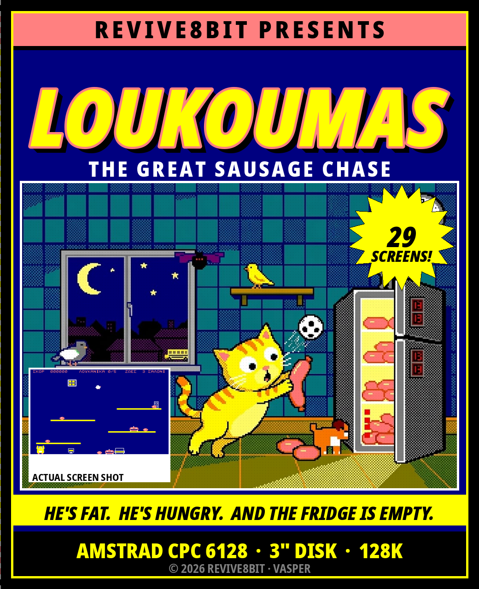
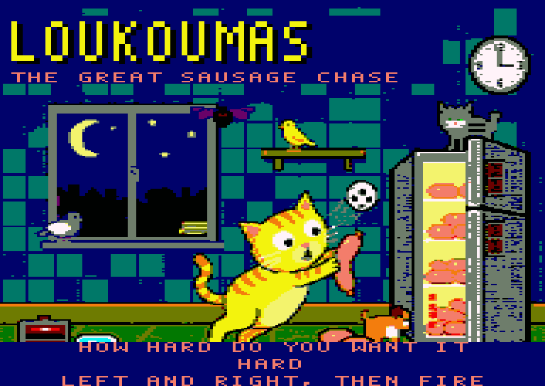

# LOUKOUMAS
## THE GREAT SAUSAGE CHASE

**AMSTRAD CPC 6128 · 3" DISK · 128K**

*A REVIVE8BIT production · © 2026*



> Ελληνικά: [MANUAL.el.md](MANUAL.el.md) · Booklet:
> [English PDF](docs/manual-en.pdf), [Greek PDF](docs/manual-el.pdf)

---

## LOADING

1. Switch on your CPC 6128 and wait for the `Ready` prompt.
2. Put the disc in drive A, label side up.
3. Type

   ```
   RUN"LOUK
   ```

   and press `ENTER`.
4. The REVIVE8BIT screen appears while the game loads. Press `SPACE` when you
   are ready, or simply wait ten seconds and it will start by itself.
5. After a second and a half of quiet the title screen paints itself onto the
   full overscan display, and the music starts.

**Do not** press `ESC` or reset while the drive light is on.

*A 464 or a 664 will not load it. The game wants 128K: it uses one whole half
of the machine as a screen.*


---

## THE STORY SO FAR

It is a quarter past three in the morning in Mrs Evdokia's flat in Kypseli.
Everybody is asleep. Everybody except one.

**Loukoumas** — a plump, overweight European Shorthair with short legs, enormous
eyes and an unappeasable love of cured meats — has been woken by a rumble in
his own stomach. Mrs Evdokia has put him on a diet, and the house is no longer
his: a robot vacuum patrols the floors all night, and her canary, the
**Tweety-Boxer**, has the run of every room.

Loukoumas starts in the basement with one intention: to climb all the way up to
the kitchen and open the big two-door Pitsos.

**And he finds it empty.**

The last one, the big one, went to school in the lunchbox of **Myrto**, Mrs
Evdokia's granddaughter. Outside, the school bus is starting its engine.

From there it stops being a raid and becomes a chase, and it lasts another
nineteen rooms: out through the back yard, across the neighbourhood, through
the whole school, into the vet's — and home over the rooftops and down the
chimney into his own fireplace, where Myrto has left him a bowl of milk.


**Twenty-nine rooms. Nine lives — or three, if you ask for them. One sausage.**

---

## THE CONTROLS

Keyboard or joystick — either, at any time.

| Keyboard | Joystick | What it does |
|---|---|---|
| `←` `→` | left / right | Walk |
| `↑` or `SPACE` | up or fire | Jump |
| `↓` | down | **Roll** — curl into a ball |
| `↓` + `SPACE` in mid-air | down + fire | **BELLY-FLOP** |
| `L` (title screen only) | — | Switch between Greek and English |
| `SPACE` (title screen) | fire | Start |
| `ESC` | — | Abandon the game and go back to the title |

**Rolling** is faster than walking *and* shorter than standing. There are gaps
in this game that a standing cat does not fit through. There is no dignity in
it. There is no dignity in any of this.

### ★ THE BELLY-FLOP ★

Jump, then hold `↓` and hit `SPACE` while you are still in the air. Loukoumas
tucks in, drops like a sack of flour and lands flat on his stomach. **The whole
room shakes** — and everything at roughly the height he landed at is stunned
where it stands, however far along the shelf it happens to be.

This is not a trick. It is the answer to a robot that patrols a whole shelf and
will not let you near the sausage on the end of it. Flop, then walk straight
through it while it sees stars.

*A stunned enemy is harmless scenery — but only until it gets back up.*

---

## YOUR SCREEN

Two rows across the top, and they are the only part of the screen that is not
the game:

```
SCORE     001700          LIVES   9
SAUSAGES  3/5             KITCHEN
```

| | |
|---|---|
| **SCORE** | Six digits. It does not reset between rooms |
| **LIVES** | Nine, six or three, depending on the difficulty you chose. That number is also the most you can hold |
| **SAUSAGES** | How many of this room's five you have found |
| **Room name** | Where you are. All twenty-nine have one |


The **border of the screen flashes** when something good happens. It is the
only thing on a screen this size that you cannot miss while you are being
chased.

---

## WHAT YOU ARE AFTER

**SAUSAGES — five in every room, 100 points each.**
Take all five and the way out of the room — a door, a vent, a fridge, a
chimney — **changes** and becomes a way through. Until then it is furniture.
You do not have to find them in any order, and nothing comes back if you lose
a life, so a room only ever gets easier.

**THE SAUCER OF MILK — every third room.**
Rooms 3, 6, 9, 12, 15, 18, 21, 24 and 27 have one, and it is **a life back** —
but never more than the number you started the game on. If you have not lost
one yet it is worth 500 points instead, so it is never wasted; it is worth a
great deal more once you have started losing them, and on hard, where you only
ever had three, it is worth more still.


It is always on the most awkward shelf in the room, and usually on the one
something is patrolling. The way out does not wait for it: you can finish the
room and leave it behind. Whether that is the right call is between you and
your remaining lives.

---

## WHAT IS AFTER YOU

Three in every room. Touching any of them costs a life and puts you back at the
start of the room with **two seconds of grace** to get out of the way.

Everything in this game either walks a shelf or flies an arc across the room.
Learn the two and you have learned all twelve:

| | Walks | Flies | Where |
|---|:---:|:---:|---|
| Robot vacuum | ● | | the flat |
| The canary | | ● | the flat |
| Next door's terrier | ● | | back yard, pavement, the vet's |
| Pigeon | | ● | park, street, rooftops |
| Wasp | | ● | anywhere with flowers |
| Football | ● | | playground, gym, pitch |
| Paper plane | | ● | the school |
| The caretaker's bucket | ● | | the school |
| Something green | ● | | the chemistry lab |
| Syringe | | ● | the vet's |
| Bat | | ● | rooftops, chimney |
| The stray tom | ● | | rooftops, car park |

Nothing shoots at you. Nothing follows you. They do not have to — the rooms are
small and you are not fast.

---

## HOW HARD DO YOU WANT IT

After the title screen, and before the first room, the game asks. Use `←` and
`→` to change it and `SPACE` to accept.



| | Lives | Enemies | The belly-flop stun lasts |
|---|:---:|---|---|
| **EASY** | 9 | Half speed | Four seconds |
| **MEDIUM** | 6 | Two thirds | Three seconds |
| **HARD** | 3 | Full speed | Two seconds |

**HARD is the game as it was designed** — three lives, and everything moving at
the speed it was drawn to move at. Easy and medium do not make Loukoumas faster
or the rooms kinder: they give you more lives and longer to think. The jump is
the same jump, the shelves are the same distance apart, and every sausage is in
the same place.

---

## SCORING

| | |
|---|---|
| Sausage | 100 |
| Saucer of milk | a life back — or 500 if you have not lost one yet |

There is no time bonus and no end-of-room bonus. The score is what you picked
up.

---

## WHEN IT ENDS

Lose your last life and the room stops where it stands with **GAME OVER**
across it. Press `SPACE` (or fire) to start again from the first room at the
same difficulty, or `ESC` to go back to the title screen — and to the language
and difficulty menus with it.


Get through all twenty-nine and you get **WELL DONE!**, which in 1986 was
considered generous.

---

## HINTS FROM THE PLAYTESTERS

* **Look before you jump.** The jump clears about forty scanlines and the
  shelves are thirty-two apart, so every shelf is reachable from the one below
  it — but only from the one below it.
* **Platforms are one-way.** You land on a shelf falling, and you pass straight
  up through it rising. That is a route, not a bug: go up through the thing you
  cannot walk around.
* **The flop is a key, not a weapon.** Nothing in this game dies. A shelf you
  cannot cross is a shelf you have not flopped on yet.
* **Take the milk when you are down a life or two.** Untouched it is only
  points; one short, it is the way back up. It is on the hardest shelf in the
  room either way, and you will not want to go back for it on your last one.
* **Learn where the canary turns.** Everything that flies bounces between the
  same two walls for ever. Stand where it has just been.
* **Rolling under something is usually faster than jumping over it**, and it is
  always safer than landing on it.
* **Escape is not a pause.** There is no pause. It was 1986.

---

## FOR THE TECHNICALLY MINDED

The whole screen is picture: 96 bytes by 272 scanlines — **26,112 bytes**, or
half the machine — and there is no border anywhere. The CRTC is programmed to
fetch across two 16K pages on a character-row boundary, which is what buys a
32K display with no mid-frame reprogramming at all, so it looks the same on
every CRTC type Amstrad ever shipped.

There is no double buffer; there is no room for one. Every sprite keeps the
patch of background it covers and hands it back before it moves. The picture is
rebuilt twenty-five times a second and the game thinks fifty times a second, so
the jump arc is exactly what it always was.

Both languages are in the same binary, and `L` repaints the text rather than
the screen.

The full story is in [loukoumas.en.md](loukoumas.en.md); how the machine is
driven is in [CLAUDE.md](CLAUDE.md).

---

## CREDITS

|  |  |
|---|---|
| Code, graphics and design | **VASPER** |
| Music | Arkos Tracker 3 (AKG player by Targhan / Arkos) |
| Published by | **REVIVE8BIT**, 2026 |

*Loukoumas is a cat. No sausages were harmed in the making of this game. The
same cannot be said for the diet.*
