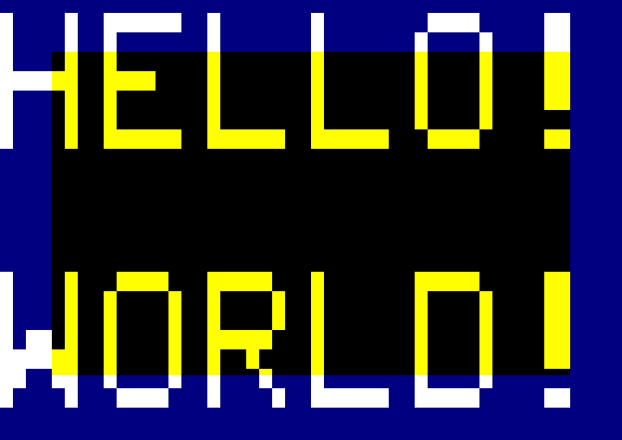
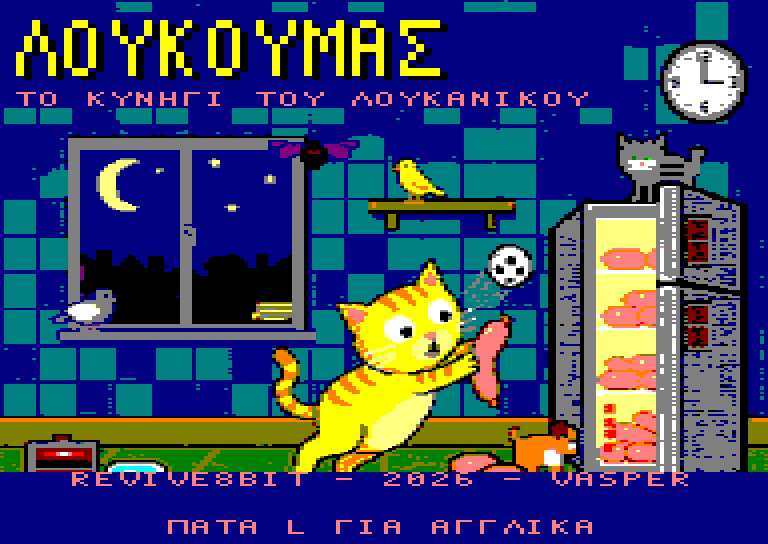
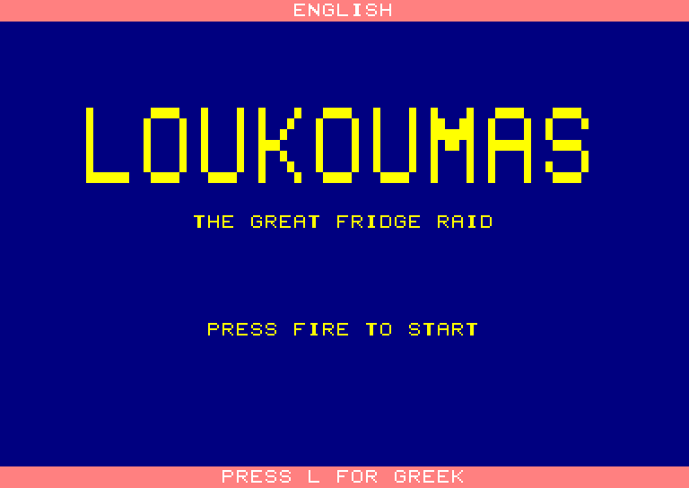
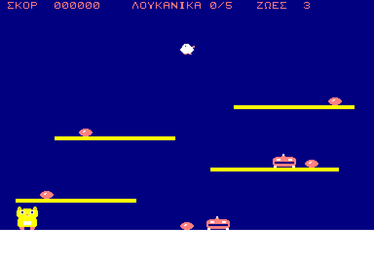
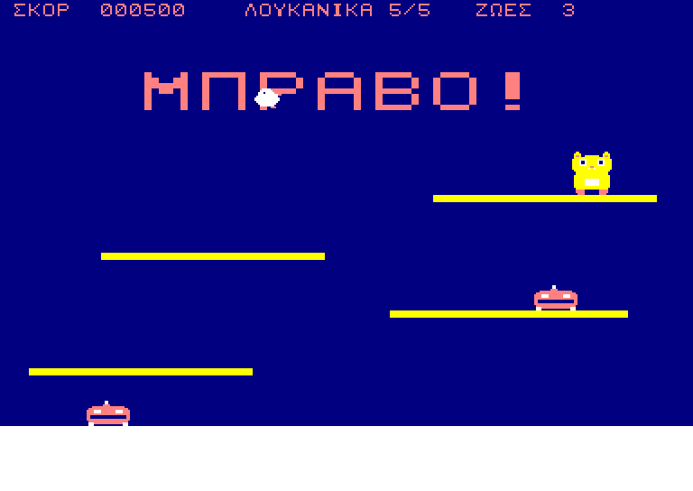
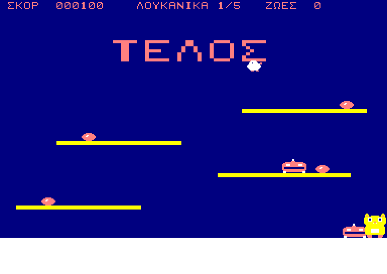

# OverscanCPC

A proof of concept for Amstrad CPC programs running in **overscan mode**, driving the
CRTC 6845 to its full capability instead of the 40x25 / 16 KB screen the firmware sets up.

## What this is

The stock CPC display is a firmware convention, not a hardware limit: 40 characters by
25 rows, one 16 KB page, surrounded by a border. The 6845 CRTC can be reprogrammed to
display far more than that — enough to push the picture out over the border on all four
sides. This repository is a proof of concept that does exactly that, and explores what
becomes possible once the CRTC is treated as a programmable raster engine rather than a
fixed-mode text controller.

Target machine: **Amstrad CPC 6128** (128 KB, CRTC types 0/1/2 as shipped).

## Goals

- Set up and hold a stable full-overscan display (48 CRTC characters wide, ~34-35 rows tall)
  on a 6128 without firmware assistance.
- Handle the >16 KB screen that overscan requires: 32 KB of video RAM, the CRTC address
  wrap, and the bank layout that makes it work.
- Demonstrate **rupture** — reprogramming R4/R9/R12/R13 mid-frame to split the display
  into independently-addressed blocks.
- Demonstrate hardware scrolling (R12/R13 coarse, R3/R5 fine) across an overscan screen.
- Demonstrate mid-screen Gate Array effects (palette and mode changes per raster line)
  inside the overscan area.
- Stay within a 312-line, 50 Hz frame so a real CTM monitor keeps sync.

## Non-goals

- Firmware compatibility. Overscan and the CPC firmware do not coexist; this runs with
  interrupts and ROMs under our own control.
- CPC Plus / ASIC-specific features. Plus hardware is out of scope except where CRTC
  type 3/4 behaviour affects compatibility.
- A finished demo or game. This is a testbed for techniques, kept small and readable.

## Status

First milestone done: a 384x272 full-overscan screen with HELLO WORLD in 64x96-pixel
letters. See [CLAUDE.md](CLAUDE.md) for the technical groundwork it is built on.

## Building

Needs [rasm](https://github.com/EdouardBERGE/rasm) on your PATH. Then:

```bash
make
```

| Target | Output | How to run it |
|--------|--------|---------------|
| `make sna` | `build/hello.sna` | drop it on an emulator |
| `make dsk` | `build/hello.dsk` | insert the disc, then `RUN"HELLO` |
| `make bin` | `build/hello.bin` | raw code, loads and runs at `#4000` |

## What the demo shows



Everything blue is picture where a stock CPC would be showing border. The black
rectangle is exactly the area a normal 40x25 mode 1 screen covers, so the demo draws
the letters straight across its edges — and because the glyphs are OR-ed onto the
background, each letter changes from yellow to white at precisely the point where a
normal screen would have clipped it.

Under the hood:

- 48x34 CRTC characters — 96 bytes by 272 scanlines, 26,112 bytes of video RAM.
- A 32 KB screen spanning `#8000-#FFFF`, with **no rupture**: the display start address
  is set to `#2C10` so that MA rolls from `#2FFF` to `#3000` after exactly 21 character
  rows, flipping MA12 and carrying the fetch from page 2 into page 3 on a row boundary.
  That sidesteps the 1024-character wrap described in CLAUDE.md section 2.
- No firmware: ROMs off, interrupts off, own stack.
- The frame stays 312 lines at 50 Hz — overscan grows the window, not the frame.

The image above is a software render of screen RAM decoded through the CPC's CRTC
addressing, not a capture from an emulator or real hardware.

## ΛΟΥΚΟΥΜΑΣ / LOUKOUMAS

The first game built on the engine, from [loukoumas.md](loukoumas.md). Title screen so
far, in Greek and English:




FIRE starts the play field, Escape comes back, L switches language. Cursor keys or
joystick to walk, FIRE or up to jump, down to roll, down plus FIRE in mid-air to
belly-flop. Collect all five sausages to finish the level — or lose three lives to the
robot vacuums and the canary:





```bash
make loukoumas
```

Both languages are in the same binary. Every line of text goes through a message id, and
`tools/mktext.py` builds one string table per language from UTF-8 files you can edit
directly:

```
text/loukoumas.el.txt     TITLE2 = Η ΜΕΓΑΛΗ ΕΠΙΔΡΟΜΗ ΣΤΟ ΨΥΓΕΙΟ
text/loukoumas.en.txt     TITLE2 = THE GREAT FRIDGE RAID
```

Greek is folded onto the font rather than doubling it: accents are dropped (all-caps
Greek is written unaccented), lowercase is raised, and the fourteen Greek capitals drawn
the same as a Latin letter — Α Β Ε Ζ Η Ι Κ Μ Ν Ο Ρ Τ Υ Χ — reuse the Latin glyph. That
leaves ten Greek-only shapes to draw, so the bilingual font is 54 glyphs, not 80. A
character with no glyph is a build error naming the string it came from.

`LANG=0/1` only picks which table `txt_lang` starts on. **L switches language while it
runs** — only the text rows are repainted, so the change is immediate rather than a
rebuild of the whole 26 KB screen.

### Sprites

There is no double buffer — a second 32 KB overscan screen plus code does not fit
comfortably in 128 KB, and repainting 26 KB of background every frame is out of the
question. So each sprite keeps the patch of background it covered, puts it back before
it moves, and takes a fresh copy at the new position. Static scenery underneath survives
being walked over for free, because it was part of what got saved — `make check` asserts
exactly that, by walking the cat over a sausage and requiring all three to still be there.

Drawing is `screen = (screen AND mask) OR data`, with mask and data interleaved so both
come off one advancing pointer. `tools/mksprite.py` builds that from ASCII art in
`assets/sprites.txt`, one character per pixel.

Sprites are byte aligned, so they step 4 pixels at a time horizontally and one scanline
vertically. Pixel-exact horizontal movement needs four pre-shifted copies of every frame;
that is worth doing when it looks wrong, not before. Every routine walks `line_tab`, so
the 2048-byte scanline stride and the jump from page 2 to page 3 at row 21 cost nothing.

### Physics

Vertical position is 8.8 fixed point — a byte of scanline and a byte of fraction, with
velocity in the same units. Whole-pixel gravity at 50 Hz either falls like a brick or
floats, and neither suits a cat the design document insists is overweight. Gravity is
0.25 px/frame, the jump leaves at 4.5 and clears about 40 pixels, and the shelves are 32
apart so each is reachable from the one below.

Platforms are one-way: you land on them coming down and pass through going up. That is
what a single-screen platform puzzle wants and it costs one comparison rather than a
swept-box intersection.

Rolling makes the cat shorter as well as faster, which is the point — 16 scanlines
instead of 24 fits under things the standing cat does not. Changing sprite height keeps
the feet anchored, so curling up and standing back up neither sinks nor hops.

The belly-flop drops at terminal velocity, lands flat, stuns for 14 frames and shakes the
room. The shake moves **R7**, the VSYNC position, which slides the whole picture against
the monitor without touching a byte of screen memory. Shifting `R12`/`R13` would have been
the obvious trick and is wrong here: the screen base is chosen so the page 2 to page 3
crossing lands exactly on a character row, and moving it scrambles the row where the
pages meet. R7 can only go up from 34 — below `R6` the VSYNC would start inside the
display.

`make check` asserts the numbers frame by frame: the jump apex, the landing on the shelf,
the flop's terminal velocity and the shake and stun it sets.

### Enemies

Two Skoupo-Terminator robots patrol at half the cat's speed and the Tweety-Boxer canary
crosses the room on a sine, from a 32-entry table of unsigned offsets so nothing has to
be signed. Touching either costs a life; the cat respawns with two seconds of grace.

The belly-flop is the answer to a robot that patrols a whole shelf. Landing on your belly
stuns everything at roughly the height you landed at, however far along the shelf it is —
the whole floor shook, not a patch of it — and a stunned enemy stops dead and is
harmless. `make check` asserts exactly that: the flop freezes the shelf robot, the cat
walks straight through it to take the sausage it was guarding, and loses no lives.

Now that more than one thing moves, ordering matters: everything is erased in the exact
reverse of the order it was drawn, so a sprite never restores background another sprite
has since been drawn into. The cat is drawn last and erased first, which is also what
puts it on top.

`make check` runs a **clean playthrough with the enemies in place**: all five sausages,
no lives lost. It has to belly-flop to get past the robot patrolling shelf 2, so that
mechanic is not decoration — the route does not survive without it. This is the level
design's own test as much as the code's: change a shelf, the jump height or a patrol and
it stops passing.

### Score and collection

The score is packed BCD, most significant byte first, so `DAA` does the arithmetic and
printing needs no division — six digits straight out of two nibbles a byte. Collection
happens between erasing the cat and redrawing it, which is the only window where a
sausage can leave the background without the cat's save buffer putting it back.

### Timing and input

The title screen runs on a real 50 Hz loop. The Gate Array interrupts every 52 scanlines,
which is *six* times per frame, so `src/irq.asm` installs a handler at `#0038` (plain RAM
once the ROMs are off), counts the six, and bumps a frame counter once per frame. The
"press fire" line blinks off that counter — driving anything straight from `HALT` would
run it six times too fast. `src/keys.asm` reads the key matrix through the PPI and the
AY-3-8912, and reports both held keys and the ones that went down this frame.

## Tools

`tools/z80check.py` runs the assembled code on a small Z80 interpreter, watches the CRTC
and Gate Array writes it makes, and decodes screen RAM through the CPC's real MA/RA
address wiring. It is how the picture above was produced, and how a screen layout gets
checked without an emulator:

```bash
make check
```

Add `--png out.png` for an image instead of the terminal preview (needs Pillow),
`--frames N` to run a game loop for a while instead of stopping at a self-jump, and
`--keys` to press keys on a schedule — `L` for the whole run, `FIRE@12-13` for those
frames only, `RIGHT@15` from there on. With `--sym` (rasm's symbol file) and `--watch
cat_y,cat_vy:s` it prints named variables once per virtual frame, which is how the
physics above is checked. It models IM 1 interrupts six to the
frame, the VSYNC bit on PPI port B, and the key matrix through the PPI, which is enough
to prove a main loop turns over and reacts to input. `make check` uses that to assert the
Greek build comes out in English when L is held.

It has **no cycle timing**. A virtual frame is a fixed number of *instructions*, not
19968 microseconds, so the six-interrupts-per-frame relationship is real but raster
position and how long a routine takes are not. No ROMs, no banking, and the picture is
one static frame taken at the end of the run — rupture and raster splits are invisible to
it. It aborts on any opcode it does not implement rather than guessing.

## Layout

```
src/        Z80 sources (rasm)
tools/      host-side helpers
build/      assembled binaries and .dsk images (not in git)
docs/       notes, register tables, measurements from real hardware
```

## Testing

CRTC behaviour is where emulators disagree most, so anything here is checked on more
than one: **ACE-DL**, **CPCEC** and **WinAPE** are the accurate references, with real
6128 hardware as the final word. Emulator CRTC type must be set explicitly for every test.
